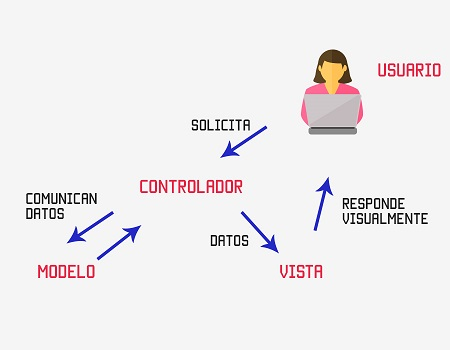
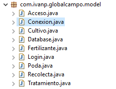
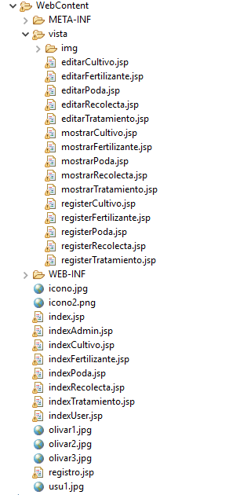
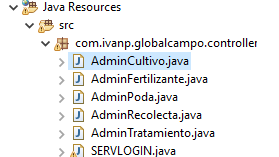
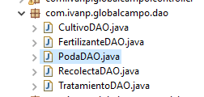
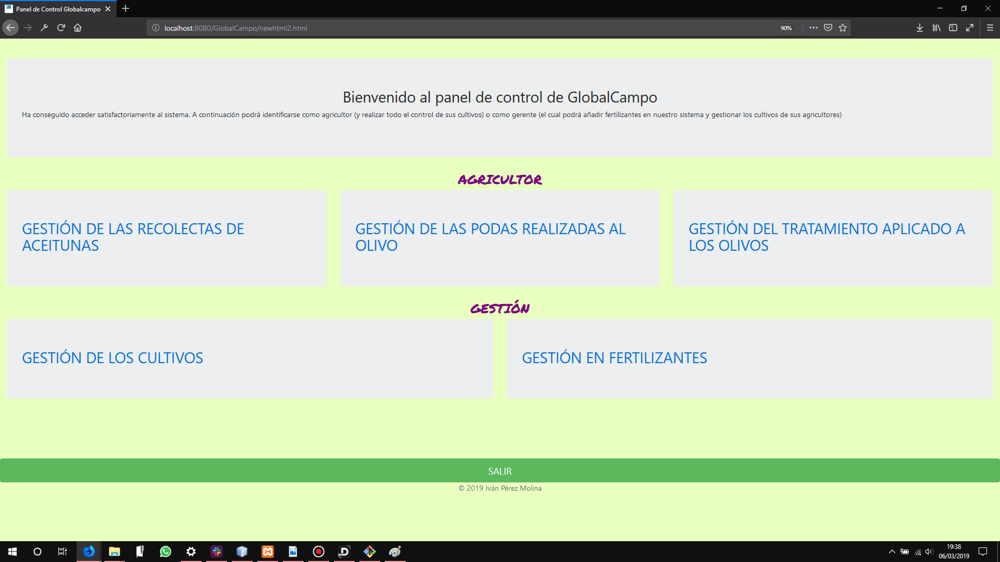
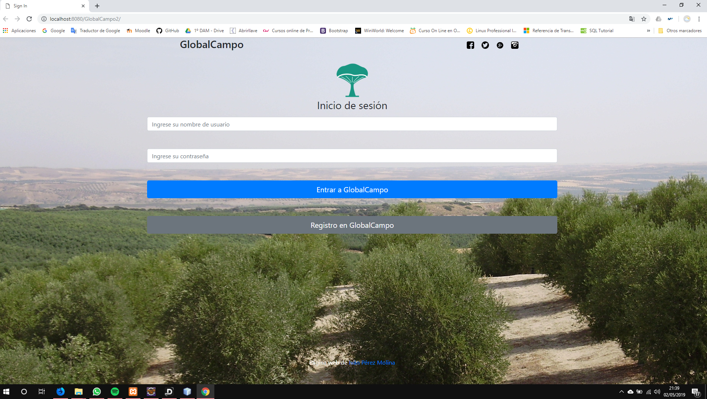
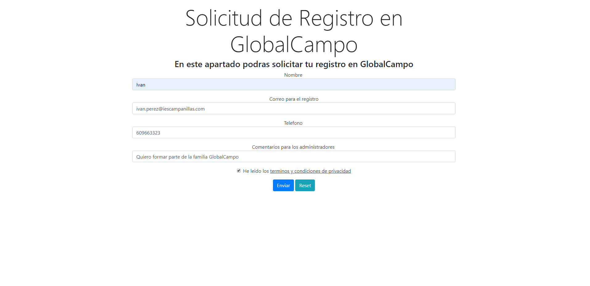
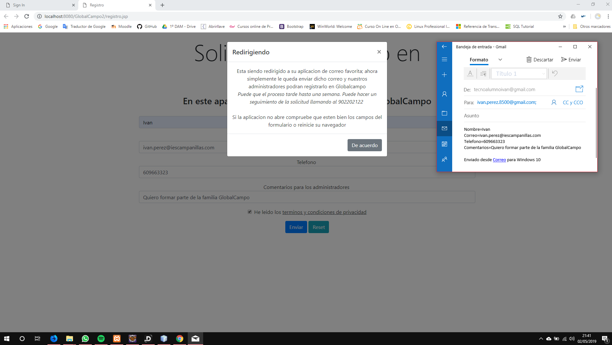

# GlobalCampo-Version2.0
Mantenemos nuestro lema: "Ayudar al agricultor a gestionar su campo "

### Presentación a la versión 2.0

Bien, despues de dos meses de formación, de nuevas ideas y también de alguna reflexiones; ya esta con nosotros la versión 2.0 de Globalcampo.

A lo largo de este repositorio voy a explicar las principales diferencias entre la versión 1.0 y la versión 2.0. Así que recomiendo antes de ver esta nueva versión, la lectura de la [versión 1.0 de Globalcampo](https://github.com/ivanperezmolina/GlobalCampo-Version1.0).

<i>Una novedad importante es que cambiamos de IDE, la versión 1 fue desarrollada en NetBeans y esta 2º versión ha sido desarrollada en Eclipse JEE, ya que para la separación en MVC y para más cosas es bastante más comodo este IDE</i>

#

#### 🌲COMENCEMOS🌲

## Separemos nuestro proyecto en Modelo - Vista- Controlador

La razón principal por la que nos interesa separar cuanto antes nuestro proyecto en MVC es la seguirdad y comodidad que tenemos sabiendo que cuando hacemos un cambio en alguna parte de nuestro código, esto no afecte otra parte del mismo.
Ademas, tendremos nuestro proyecto separado, así si tenemos un error en la vista que mostramos al usuario; no es necesario revisar un documento que incluya todo el código mezclado.

 

Expliquemos un poco que hace cada parte del patrón MVC:

#### MODELO

Se encarga de los datos, generalmente consultando la base de datos. Actualizaciones, consultas, búsquedas, etc. 
En el modelo de GlobalCampo 2.0 se incluyem las conexiones con la BBDD, la clase del login y todas las clases que incluye nuestro proyecto (Poda.java // Recolecta.java...)

 

#### VISTA

Son la representación visual de los datos, todo lo que tenga que ver con la interfaz gráfica va aquí. Ni el modelo ni el controlador se preocupan de cómo se verán los datos, esa responsabilidad es únicamente de la vista. 
En la vista de GlobalCampo 2.0 se incluyen los ficheros .jsp que será lo que el usuario vea (index.jsp // editarPoda.jsp...)

 

#### CONTROLADOR

Se encarga de... controlar, recibe las órdenes del usuario y se encarga de solicitar los datos al modelo y de comunicárselos a la vista.
Es lo que se conoce como un Servlet, el cual va a gestionar todo
Los servlet que incluye GlobalCampo 2.0 son los que para cada acción del agricultor se debe administrar (un servlet para las podas, otro para las recolectas...)

 

#### DAO (Objeto de acceso a datos)

El DAO va a incluir todas las "sentencias SQL" que vamos a hacer a la BBDD. 

 

## Pongamos un "logueo" y un "registrar" a GlobalCampo2.0

Si recordamos la [versión 1.0 de Globalcampo](https://github.com/ivanperezmolina/GlobalCampo-Version1.0) podiamos ver que al entrar en el panel de control podiamos tener acceso total a la aplicación, sin importar quien fueramos:

 

En esta 2º versión esto ha cambiado, ya tenemos nuestra pantalla en la cual podemos loguearnos (dependiendo de si somos un agricultor o un gerente de cooperativa) y también podemos solicitar un registro en la aplicación de GlobalCampo; vamos a ver cada una de las pantallas:

#### Pantalla principal

Esta vez, cuando ejecutamos nuestro proyecto nos encontramos directamente con una pantalla la cual nos pide un usuario y contraseña; tenemos la opción de entrar con un usuario y contraseña que tengamos o bien solicitar un registro.

 

#### Solicitud de registro

En esta pantalla, un usuario podrá solicitar que le den acceso a la aplicación para ello debe completar una serie de campos como son: su nombre, su correo electrónico, su teléfono y algún comentario. 

 

Una vez este todo bien rellenado la aplicación redirige a nuestra aplicación de correo favorita y envia un correo al equipo de administración de GlobalCampo para dar de alta al usuario

 

#### ☘VIDEO EXPLICATIVO☘

https://youtu.be/BXZDCDlUeuc

