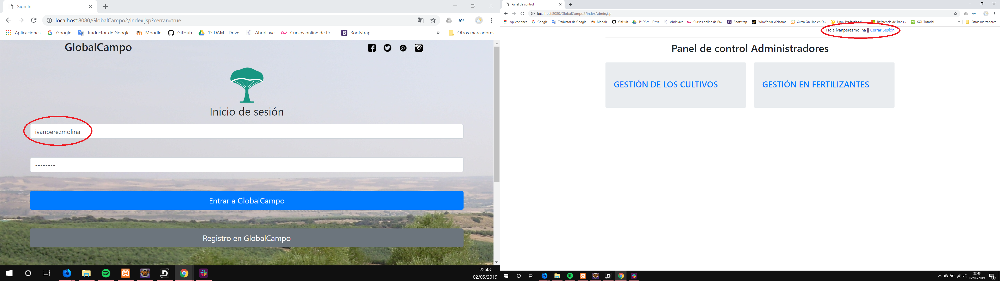
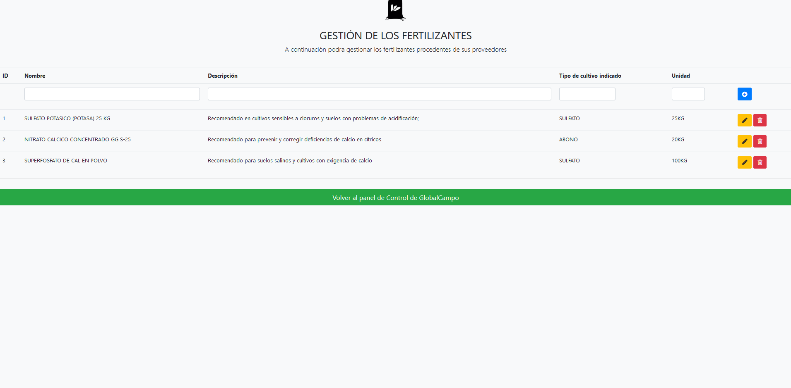
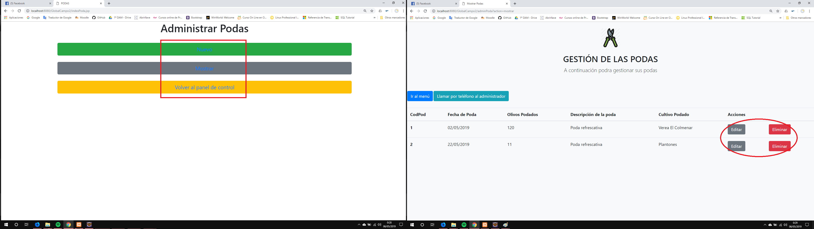
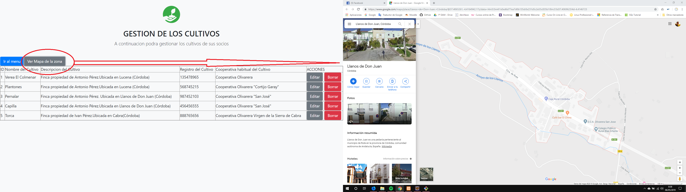

# GlobalCampo-Version2.0
Mantenemos nuestro lema: "Ayudar al agricultor a gestionar su campo "

### Presentación de la versión 2.0

Bien, después de dos meses de formación, de nuevas ideas y también de algunas reflexiones; ya está con nosotros la versión 2.0 de Globalcampo.

A lo largo de este repositorio voy a explicar las principales diferencias entre la versión 1.0 y la versión 2.0. Así que, recomiendo antes de ver esta nueva versión, la lectura de la [versión 1.0 de Globalcampo](https://github.com/ivanperezmolina/GlobalCampo-Version1.0).

<i>Una novedad importante es que cambiamos de IDE, la versión 1 fue desarrollada en NetBeans y esta 2º versión ha sido desarrollada en Eclipse JEE, ya que para la separación en MVC y para más cosas es bastante más cómodo este IDE</i>

#

#### 🌲COMENCEMOS🌲


## Separemos nuestro proyecto en Modelo - Vista- Controlador

La razón principal por la que nos interesa separar cuanto antes nuestro proyecto en MVC es la seguridad y comodidad que tenemos sabiendo que cuando hacemos un cambio en alguna parte de nuestro código, esto no afectara a otra parte de este.
Además, si tenemos un error en la vista que mostramos al usuario; no es necesario revisar un documento que incluya todo el código mezclado.

<p align="center"> 


</p>

Expliquemos un poco que hace cada parte del patrón MVC:

### MODELO

Se encarga de los datos, generalmente consultando la base de datos. Actualizaciones, consultas, búsquedas, etc. 
En el modelo de GlobalCampo 2.0 se incluyen las conexiones con la BBDD, la clase del login y todas las clases que incluye nuestro proyecto (Poda.java // Recolecta.java...)

<p align="center"> 


</p>

### VISTA

Son la representación visual de los datos, todo lo que tenga que ver con la interfaz gráfica va aquí. Ni el modelo ni el controlador se preocupan de cómo se verán los datos, esa responsabilidad es únicamente de la vista. 
En la vista de GlobalCampo 2.0 se incluyen los ficheros .jsp que será lo que el usuario vea (index.jsp // editarPoda.jsp...)

<p align="center"> 


</p>

### CONTROLADOR

Se encarga de... controlar, recibe las órdenes del usuario y se encarga de solicitar los datos al modelo y de comunicárselos a la vista.
Es lo que se conoce como un Servlet, el cual va a gestionar todo.
Los servlet que incluye GlobalCampo 2.0 son los que para cada acción del agricultor se debe administrar (un servlet para las podas, otro para las recolectas...)

<p align="center"> 


</p>

### DAO (Objeto de acceso a datos)

El DAO va a incluir todas las "sentencias SQL" que vamos a hacer a la BBDD. 

<p align="center"> 


</p>

<hr><hr>

## Pongamos un "logueo" y un "registrar" a GlobalCampo2.0

Si recordamos la [versión 1.0 de Globalcampo](https://github.com/ivanperezmolina/GlobalCampo-Version1.0) podíamos ver que al entrar en el panel de control teníamos acceso total a la aplicación, sin importar quien fuéramos:

<p align="center"> 


</p>

En esta 2º versión esto ha cambiado, ya tenemos nuestra pantalla en la cual podemos loguearnos (dependiendo de si somos un agricultor o un gerente de cooperativa) y también podemos solicitar un registro en la aplicación de GlobalCampo; vamos a ver cada una de las pantallas:

### Pantalla principal

Esta vez, cuando ejecutamos nuestro proyecto nos encontramos directamente con una pantalla la cual nos pide un usuario y contraseña; tenemos la opción de entrar con un usuario y contraseña que tengamos o bien solicitar un registro.

<p align="center"> 


</p>

### Solicitud de registro

En esta pantalla, un usuario podrá solicitar que le den acceso a la aplicación para ello debe completar una serie de campos como son: su nombre, su correo electrónico, su teléfono y algún comentario. 

<p align="center"> 


</p>

Una vez este todo bien rellenado la aplicación redirige a nuestra aplicación de correo favorita y envía un correo al equipo de administración de GlobalCampo para dar de alta al usuario


<p align="center"> 


</p>

<hr><hr>

## Incluimos variables de sesión a nuestro CRUD

Un requisito necesario en esta nueva versión de nuestro CRUD es añadir variables de sesión; después de un largo estudio he visto mejor añadirlas en dos partes de mi proyecto; veámoslo:

### Identificador de persona en la barra de arriba

Una vez hemos accedido a GlobalCampo (bien como gestor o como agricultor); podemos ver que nuestro nombre (con el cual estemos registrados) se muestra en la parte superior con la opción de cerrar sesión. 

<p align="center"> 



</p>

El código que se encarga de todo esto es el siguiente:

#### 1º pantalla

``` java
	HttpSession sesion = request.getSession();
    int nivel =0;
    
    		if(request.getAttribute("nivel")!=null){
    			nivel = (Integer) request.getAttribute("nivel");
    			if(nivel==1){
    				sesion.setAttribute("nombre", request.getAttribute("nombre"));
    				sesion.setAttribute("nivel", nivel);
    				response.sendRedirect("indexAdmin.jsp");
    			}else if(nivel==2){
    				sesion.setAttribute("nombre", request.getAttribute("nombre"));
    				sesion.setAttribute("nivel", nivel);
    				response.sendRedirect("indexUser.jsp");
    				
    			}
    		}
    		
    		if(request.getParameter("cerrar")!=null){
    			session.invalidate();
    			
    			
    		}
	
```

#### 2º pantalla

``` java

<p style="text-align: right;"> Hola <%=sesion.getAttribute("nombre") %> ||  <a href="index.jsp?cerrar=true">Cerrar Sesión</a></p>
``` 

### Seguridad en cada página

Es posible que alguien intente acceder a GlobalCampo como administrador sin serlo; me explico. Alguien ha copiado la dirección de la página de los administradores e intenta acceder a partir de ella; pues esto no es posible gracias al siguiente código que se encarga de que la persona forzosamente tenga que hacer un login para disfrutar de GlobalCampo:


``` java
 <%-- AÑADO SEGURIDAD PARA QUE TENGAN QUE PASAR POR EL LOGIN --%>
    <%
    
    HttpSession sesion = request.getSession();
    
    if(sesion.getAttribute("nivel")==null){
    	response.sendRedirect("index.jsp");
    	
    }else{
    	String nivel = sesion.getAttribute("nivel").toString();
    	if(!nivel.equals("1")){
    		response.sendRedirect("index.jsp");    		
    	}
    }
    
    
    %>
``` 


<hr><hr>

## Un diseño más intuitivo

Si recordamos la [versión 1.0 de Globalcampo](https://github.com/ivanperezmolina/GlobalCampo-Version1.0) veíamos que a la hora de modificar o registrar un cultivo, poda... la persona que fuera a hacer dicha tarea tenía todo en una misma página y tenía que apañárselas con los iconos.

<p align="center"> 



</p>

<i>He llegado a la conclusión de que es mejor dejar cada tarea bien diferenciada ya que he presentado el proyecto de GlobalCampo a varios agricultores de mi familia y todos compartían la misma opinión, veían mejor separar tareas</i>; por eso en esta nueva versión incluimos dentro de una misma gestión las tareas bien diferenciadas.

<p align="center"> 



</p>


<hr><hr>

## Despedida

Bien, pues hasta aquí los cambios incorporados a la versión 2 de GlobalCampo. Como siempre hay que recordar que estamos en continuo desarrollo; así que pronto habrá una nueva versión con mejor diseño, manejo y de todo

<i>Si quieres dar alguna idea puedes enviar un e-mail a ivan.perez.8500@gmail.com</i>

### ¡Nuevas funciones que todavía están en desarrollo!

Estoy trabajando en incluir nuevas funciones como un botón para ver la localización de nuestros cultivos, otro para llamar a nuestra cooperativa o al gerente de algún fertilizante; dejo alguna captura muy temprana de esas innovaciones:


<p align="center"> 



</p>

#### ☘VIDEO EXPLICATIVO☘

https://youtu.be/BXZDCDlUeuc


